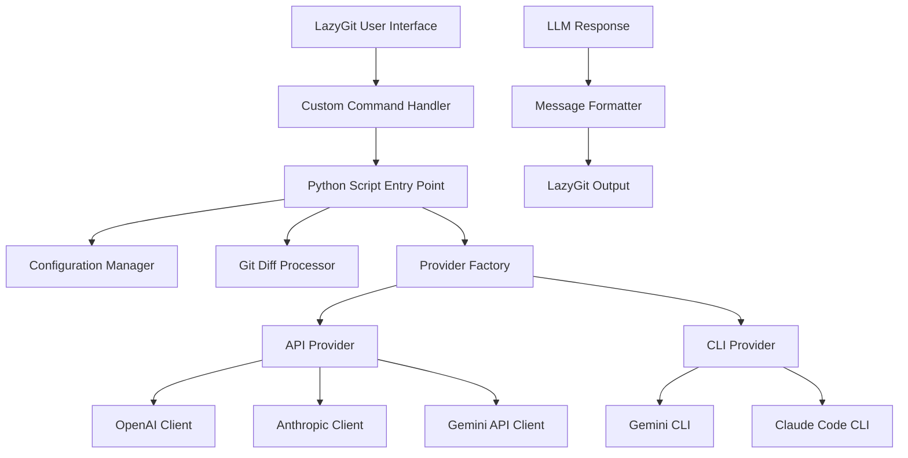

# Design Document

## Overview

The LazyGit-LLM commit message generator is implemented as a Python script that integrates with LazyGit through its custom command functionality. The system follows a modular architecture that supports multiple LLM providers (both API-based and CLI-based) and provides flexible configuration management.

## Architecture

### High-Level Architecture



### Component Interaction Flow

1. **User Trigger**: User presses configured key in LazyGit
2. **Git Diff Extraction**: LazyGit executes `git diff --staged` and pipes output to Python script
3. **Configuration Loading**: Script loads settings from config.yml
4. **Provider Selection**: Factory pattern selects appropriate LLM provider
5. **Message Generation**: Provider processes diff and generates commit message
6. **Output Formatting**: Response is formatted and returned to LazyGit
7. **Display**: LazyGit displays the generated message in commit panel

## Components and Interfaces

### 1. Configuration Manager (`config_manager.py`)

**Responsibilities:**
- Load and validate configuration from YAML file
- Manage environment variable fallbacks
- Provide secure API key handling

**Interface:**
```python
class ConfigManager:
    def load_config(self, config_path: str) -> Dict[str, Any]
    def get_api_key(self, provider: str) -> str
    def get_model_name(self, provider: str) -> str
    def get_prompt_template(self) -> str
    def validate_config(self) -> bool
```

### 2. Git Diff Processor (`git_processor.py`)

**Responsibilities:**
- Parse git diff output from stdin
- Validate that staged changes exist
- Format diff data for LLM consumption

**Interface:**
```python
class GitDiffProcessor:
    def read_staged_diff(self) -> str
    def has_staged_changes(self) -> bool
    def format_diff_for_llm(self, diff: str) -> str
```

### 3. Provider Factory (`provider_factory.py`)

**Responsibilities:**
- Determine provider type (API vs CLI)
- Instantiate appropriate provider class
- Handle provider-specific configuration

**Interface:**
```python
class ProviderFactory:
    def create_provider(self, provider_name: str, config: Dict) -> BaseProvider
    def get_supported_providers(self) -> List[str]
```

### 4. Base Provider Interface (`base_provider.py`)

**Responsibilities:**
- Define common interface for all providers
- Handle common error scenarios
- Provide streaming support interface

**Interface:**
```python
class BaseProvider(ABC):
    @abstractmethod
    def generate_commit_message(self, diff: str, prompt_template: str) -> str
    @abstractmethod
    def test_connection(self) -> bool
    def supports_streaming(self) -> bool
```

### 5. API Providers (`api_providers/`)

**OpenAI Provider (`openai_provider.py`):**
```python
class OpenAIProvider(BaseProvider):
    def __init__(self, api_key: str, model: str)
    def generate_commit_message(self, diff: str, prompt_template: str) -> str
```

**Anthropic Provider (`anthropic_provider.py`):**
```python
class AnthropicProvider(BaseProvider):
    def __init__(self, api_key: str, model: str)
    def generate_commit_message(self, diff: str, prompt_template: str) -> str
```

**Gemini API Provider (`gemini_api_provider.py`):**
```python
class GeminiAPIProvider(BaseProvider):
    def __init__(self, api_key: str, model: str)
    def generate_commit_message(self, diff: str, prompt_template: str) -> str
```

### 6. CLI Providers (`cli_providers/`)

**Gemini CLI Provider (`gemini_cli_provider.py`):**
```python
class GeminiCLIProvider(BaseProvider):
    def __init__(self, model: str)
    def generate_commit_message(self, diff: str, prompt_template: str) -> str
    def _execute_gemini_cli(self, prompt: str) -> str
```

**Claude Code Provider (`claude_code_provider.py`):**
```python
class ClaudeCodeProvider(BaseProvider):
    def __init__(self, model: str)
    def generate_commit_message(self, diff: str, prompt_template: str) -> str
    def _execute_claude_code(self, prompt: str) -> str
```

**CLI Security Requirements:**
CLI execution methods (`_execute_gemini_cli` and `_execute_claude_code`) must implement robust security controls:
- Use subprocess with `shell=False` and argument lists (never string concatenation)
- Enforce fixed command prefix with allowlist of permitted binaries/flags
- Validate and sanitize user tokens through strict whitelisting
- Use explicit minimal environment (avoid inheriting full environment)
- Set mandatory hard timeouts for all CLI executions
- Limit captured stdout/stderr size with truncation if exceeded
- Log only safe metadata (never raw CLI output containing user inputs)

### 7. Message Formatter (`message_formatter.py`)

**Responsibilities:**
- Clean and format LLM responses
- Handle different response formats
- Ensure output compatibility with LazyGit

**Interface:**
```python
class MessageFormatter:
    def format_response(self, raw_response: str) -> str
    def clean_message(self, message: str) -> str
    def validate_message_format(self, message: str) -> bool
```

## Data Models

### Configuration Schema

```yaml
# config.yml
provider: "openai"  # openai, anthropic, gemini-api, gemini-cli, claude-code
model_name: "gpt-4"
api_key: "${OPENAI_API_KEY}"  # Environment variable reference
prompt_template: |
  Based on the following git diff, generate a concise commit message that follows conventional commits format:
  
  {diff}
  
  Generate only the commit message, no additional text.
timeout: 30
max_tokens: 100
```

### Provider Configuration

```python
@dataclass
class ProviderConfig:
    name: str
    type: str  # "api" or "cli"
    model: str
    api_key: Optional[str] = None
    timeout: int = 30
    max_tokens: int = 100
    additional_params: Dict[str, Any] = field(default_factory=dict)
```

### Diff Data Structure

```python
@dataclass
class DiffData:
    raw_diff: str
    file_count: int
    additions: int
    deletions: int
    files_changed: List[str]
```

## Error Handling

### Error Categories

1. **Configuration Errors**
   - Missing config file
   - Invalid YAML syntax
   - Missing required fields
   - Invalid API keys

2. **Git Errors**
   - No staged changes
   - Git command failures
   - Repository not found

3. **Provider Errors**
   - API authentication failures
   - Network timeouts
   - Rate limiting
   - CLI command not found

4. **Response Errors**
   - Invalid LLM responses
   - Empty responses
   - Malformed output

### Error Handling Strategy

```python
class ErrorHandler:
    def handle_config_error(self, error: ConfigError) -> str
    def handle_git_error(self, error: GitError) -> str
    def handle_provider_error(self, error: ProviderError) -> str
    def handle_response_error(self, error: ResponseError) -> str
```

### Error Messages

- Configuration errors: "Configuration error: {specific_issue}"
- No staged changes: "No staged files found. Stage your changes first."
- API errors: "Failed to connect to {provider}: {error_message}"
- CLI errors: "CLI command failed: {command} - {error_message}"

## Testing Strategy

### Unit Tests

1. **Configuration Manager Tests**
   - Valid/invalid YAML parsing
   - Environment variable resolution
   - Security validation

2. **Git Processor Tests**
   - Diff parsing with various formats
   - Empty diff handling
   - Large diff handling

3. **Provider Tests**
   - Mock API responses
   - CLI command execution
   - Error scenario handling

4. **Integration Tests**
   - End-to-end workflow
   - LazyGit integration
   - Multiple provider switching

### Test Structure

```
tests/
├── unit/
│   ├── test_config_manager.py
│   ├── test_git_processor.py
│   ├── test_providers/
│   │   ├── test_openai_provider.py
│   │   ├── test_anthropic_provider.py
│   │   ├── test_gemini_providers.py
│   │   └── test_claude_code_provider.py
│   └── test_message_formatter.py
├── integration/
│   ├── test_end_to_end.py
│   └── test_lazygit_integration.py
└── fixtures/
    ├── sample_diffs/
    └── config_examples/
```

### Mock Strategy

- Use `unittest.mock` for API calls
- Use `subprocess.mock` for CLI commands
- Create fixture files for various git diff scenarios
- Mock LazyGit environment variables

## Security Considerations

### API Key Management

1. **Storage**: Never store API keys in code or version control
2. **Access**: Use environment variables or secure config files
3. **Permissions**: Recommend 600 permissions for config files
4. **Validation**: Validate API keys without exposing them in logs

### Input Validation

1. **Diff Content**: Sanitize git diff output before sending to LLM
2. **Configuration**: Validate all configuration parameters
3. **Command Injection**: Prevent injection in CLI provider commands

### Network Security

1. **HTTPS**: Ensure all API calls use HTTPS
2. **Timeouts**: Implement reasonable timeouts for all network calls
3. **Rate Limiting**: Respect provider rate limits

## Performance Considerations

### Optimization Strategies

1. **Caching**: Cache provider instances and configuration
2. **Async Operations**: Use async/await for API calls where possible
3. **Diff Size Limits**: Limit maximum diff size sent to LLM
4. **Connection Pooling**: Reuse HTTP connections for API providers

### Performance Targets

- **Startup Time**: < 1 second for script initialization
- **API Response**: < 10 seconds for commit message generation
- **Memory Usage**: < 50MB peak memory usage
- **CLI Execution**: < 5 seconds for CLI-based providers

## Deployment and Installation

### Package Structure

```
lazygit-llm-commit-generator/
├── src/
│   ├── __init__.py
│   ├── main.py
│   ├── config_manager.py
│   ├── git_processor.py
│   ├── provider_factory.py
│   ├── base_provider.py
│   ├── message_formatter.py
│   ├── api_providers/
│   └── cli_providers/
├── config/
│   └── config.yml.example
├── tests/
├── docs/
│   └── README.md
├── requirements.txt
└── setup.py
```

### Installation Process

1. **Python Environment**: Require Python 3.9+
2. **Dependencies**: Install via pip from requirements.txt
3. **Configuration**: Copy and customize config.yml.example
4. **LazyGit Setup**: Add custom command to LazyGit config
5. **Permissions**: Set appropriate file permissions

### LazyGit Integration

```yaml
# LazyGit config.yml
customCommands:
  - key: '<c-g>'
    command: 'python3 /path/to/lazygit-llm-commit-generator/src/main.py'
    context: 'files'
    description: 'Generate commit message with LLM'
    stream: true
```